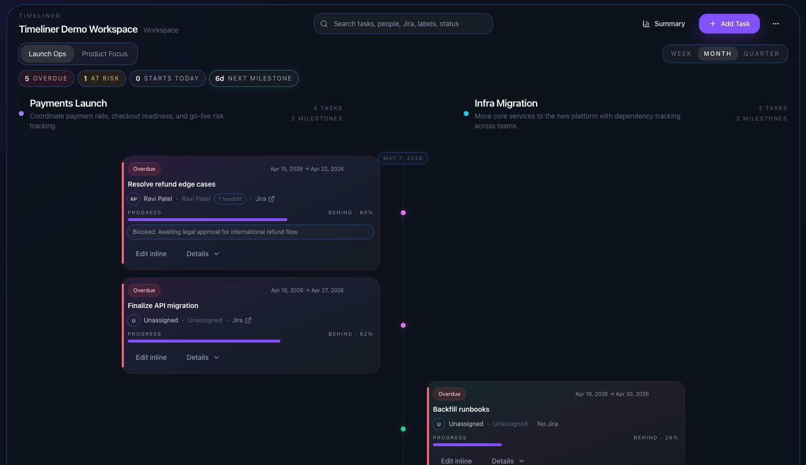
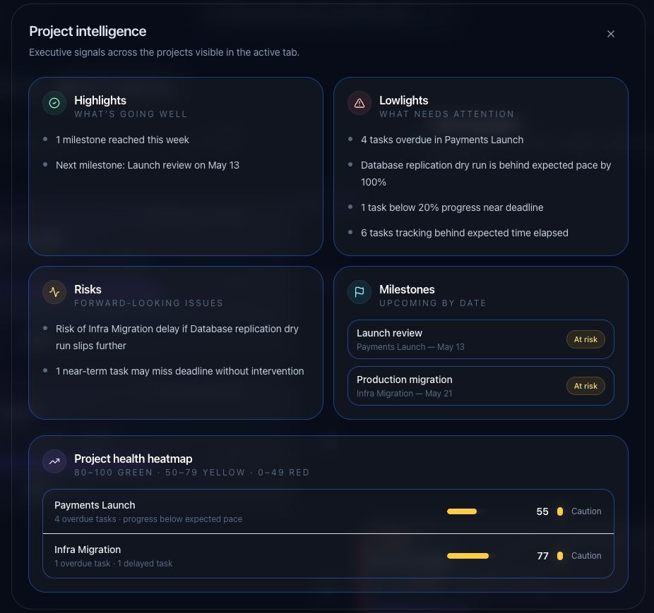

# Timeliner

[🌐 Live Demo](https://tusharagey.github.io/Timeliner)

Timeliner is a React + TypeScript + Vite MVP for PMs managing multiple projects in a local folder-backed workspace. It runs entirely in the browser, uses the File System Access API for persistence, and stores everything as JSON files in a user-selected workspace directory.

## Features

- Local workspace creation/open flow with File System Access API
- Seed demo workspace with 3 realistic projects:
  - Payments Launch
  - Mobile Revamp
  - Infra Migration
- Zustand-powered app state with debounced autosave
- Zod schemas for workspace, project, task, label, and people models
- Vertical timeline layout with sticky Today marker
- Side-by-side project tabs with one or two visible project panels
- Inline task editing, deletion, progress changes, and date updates
- Natural language add-task modal with regex-based parsing fallback to manual entry
- Global search across title, assignee, Jira, labels, deliverables, and status
- Project summary modal with live metrics

## Tech Stack

- React 19
- TypeScript
- Vite
- Zustand
- Tailwind CSS
- date-fns
- zod

## Workspace Structure

```text
/timeliner-workspace
  workspace.json
  /projects
    payments.json
    mobile.json
    infra.json
  /lookups
    people.json
    labels.json
```

## Getting Started

### Requirements

- Node.js 18+
- A Chromium-based browser for File System Access API support

### Install

```bash
npm install
```

### Run in development

```bash
npm run dev
```

Open the local Vite URL in Chrome, Edge, Arc, or another Chromium browser.

### Build for production

```bash
npm run build
```

### Lint

```bash
npm run lint
```

## How it works

On first launch, Timeliner shows:

- Create Workspace
- Open Existing Workspace

When creating a workspace, the app scaffolds the required folder structure and writes seed JSON files. When opening an existing workspace, Timeliner validates the stored JSON with zod schemas before hydrating the UI.

The selected folder handle is persisted in IndexedDB when possible to speed up reopening the workspace in future sessions.

## Screenshots


_Landing page with workspace creation and open options_


_Project summary modal with live metrics and timeline view_

## Notes

- If the File System Access API is unavailable, the app shows a helpful Chromium-browser requirement message.
- Data is stored only on the local machine. There is no backend, auth, or cloud sync.
- Autosave is debounced and manual save is also available from the header.

---

> **Vibe Coded** — This application was fully vibe coded using ChatGPT Codex and Deepseek. Expect bugs.
